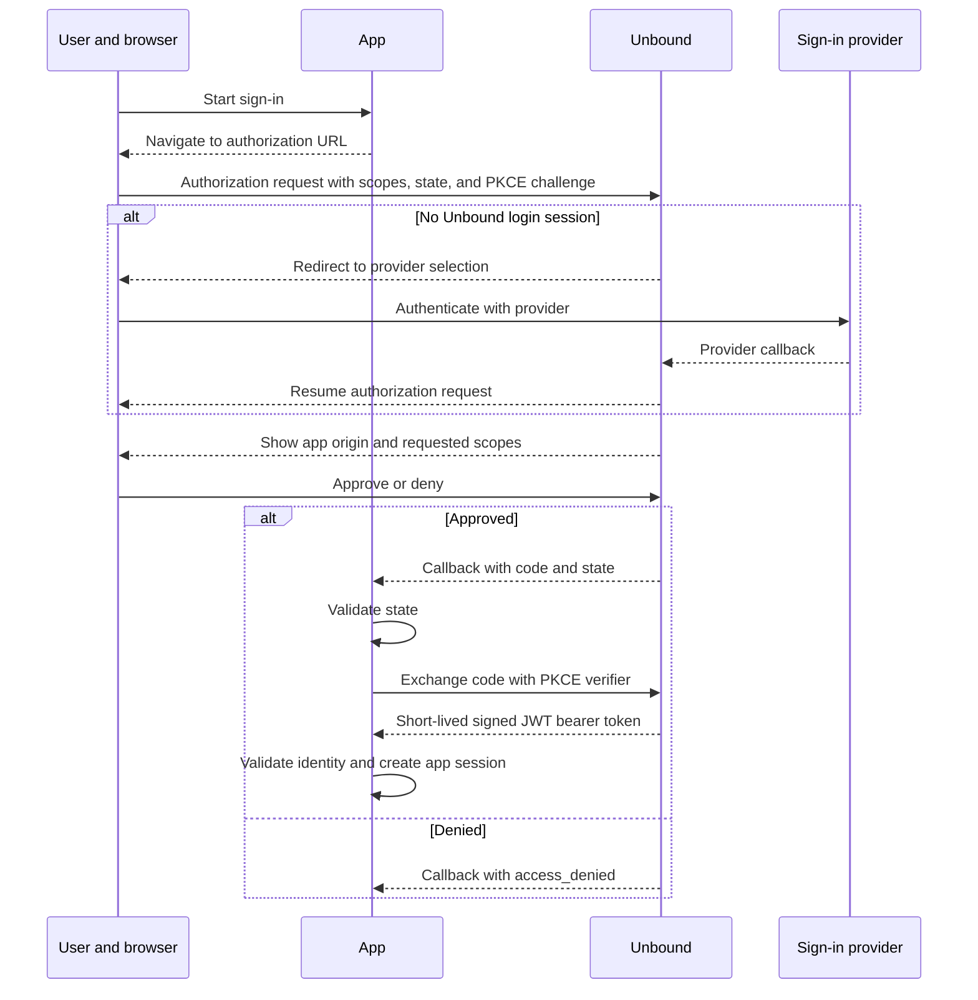

Unbound connects two related flows: provider login establishes the user’s local Unbound browser session, and app authorization lets the user approve identity data for a destination app.

## The four actors

| Actor | Role |
|---|---|
| **User and browser** | Start sign-in, move between services, authenticate, and approve or deny the request. |
| **App** | Starts authorization, receives the callback, validates identity, and creates its own session and permissions. |
| **Unbound** | Brokers provider login, presents app consent, issues the authorization code, and exchanges it for a token. |
| **Sign-in provider** | Authenticates the provider account and returns identity fields to Unbound. |

## Two connected boundaries

**Upstream provider login** is between Unbound and Google, GitHub, or Discord. Unbound uses provider state and S256 PKCE, fetches the provider profile, normalizes it, and stores the resulting Unbound login state in a local encrypted cookie.

**Downstream app authorization** is between the app and Unbound. The app requests scopes, the user consents, and Unbound returns an authorization code to the app callback. The official TypeScript client uses state and S256 PKCE for this flow.

Unbound does not pass provider access tokens to the app. The downstream token contains an app-scoped Unbound subject and only the approved claims that are available.

## Complete sequence

## State and PKCE

`state` binds the callback to the sign-in attempt. The browser client stores one state value for the current tab and compares it when completing a normal browser callback. Server integrations must save, validate, and consume state in app-managed session storage because explicit-code and server completion do not validate it inside the client.

PKCE binds the code exchange to the client that started the flow. The official client creates a temporary verifier, sends its S256 challenge with the authorization request, and sends the verifier only during token exchange.

<Callout title="Security requirement" type="warning">
  Treat state, the PKCE verifier, the authorization code, and tokens as sensitive. Do not log them. Starting another flow in the same default storage namespace overwrites the one pending state and verifier, so concurrent sign-ins in one tab are not reliable.
</Callout>

The Unbound server currently accepts a downstream request without PKCE or state, but official-client integrations use both. This server behavior is not a reason for an app to omit them.

## Consent and scopes

The authorization screen shows the app origin and requested scopes. The user can approve or deny the request. The current scopes are `openid`, `profile`, and `email`; only approved, available profile and email fields are included downstream.

A denial returns an `access_denied` error. The current denial path does not echo the original state, so apps should handle denial as a fresh failed attempt rather than promising a state-bearing callback.

## Code exchange and token

After approval, Unbound returns a short-lived encrypted authorization code bound to the exact callback URI. The app exchanges it with the same callback URI, public origin-derived client ID, and PKCE verifier.

The response contains a short-lived signed JWT bearer access token. The default token lifetime is 15 minutes. When `openid` was requested, the current response also exposes the same JWT as `id_token`.

Apps must validate the token signature, allowed algorithm and key, issuer, audience, expiration, and relevant claims before trusting identity or creating a privileged session. Browser-default decoding alone is not proof of authenticity.

## Logout boundaries

Client `logout()` is local logout: it removes the client’s loaded local token. The Unbound profile logout clears the local Unbound browser session. Neither action signs the user out of the external provider, revokes an already issued token, or automatically ends a separate app session.

For storage details, continue to [Stateless design](/docs/concepts/stateless-design). For complete fields, see [Identity, scopes, and claims](/docs/concepts/identity-scopes-and-claims).
